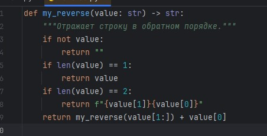
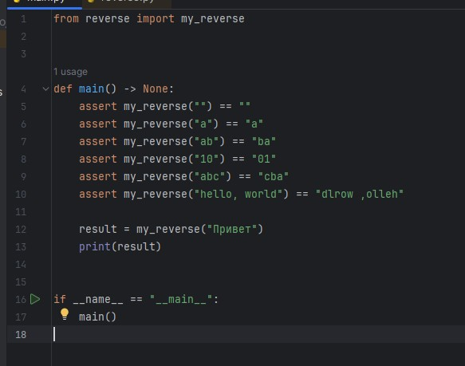
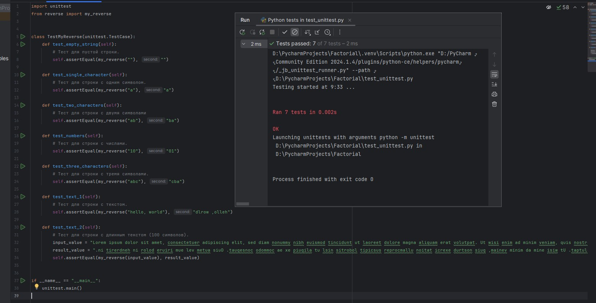
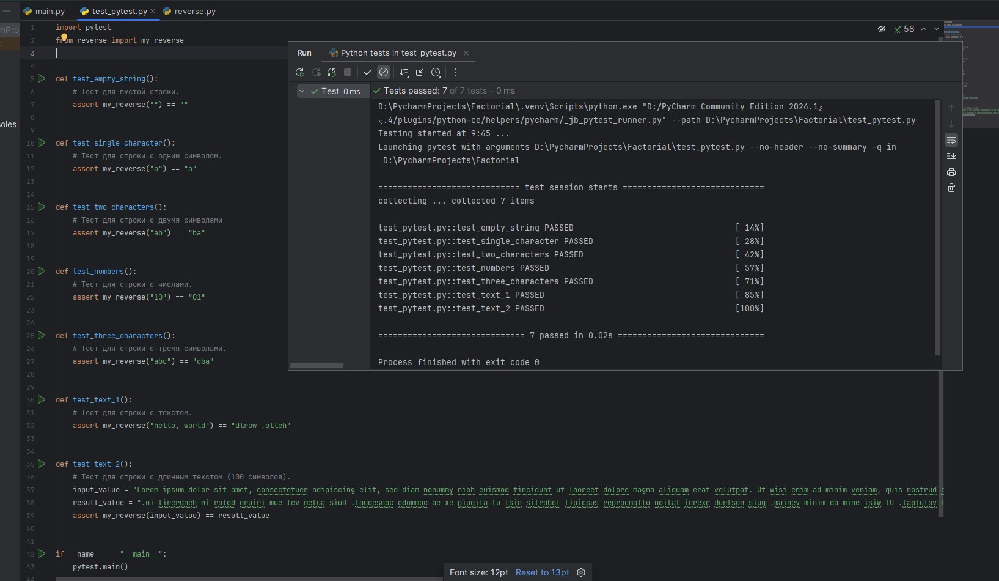

## Введение
Сделал простую функцию, которая будет рекурсивно отзеркаливать строку ("abc" ---> "bca"). Поместил функцию в отдельный файл: [reverse.py](https://github.com/ytkinroman/tekhnologii_programmirovaniya_1/blob/main/reverse.py).

 
 
## 1. Применение assert
Поместил тестирование отдельный файл: [test_assert.py](https://github.com/ytkinroman/tekhnologii_programmirovaniya_1/blob/main/test_assert.py).

## 2. Применение Unittest
Поместил тестирование отдельный файл: [test_unittest.py](https://github.com/ytkinroman/tekhnologii_programmirovaniya_1/blob/main/test_unittest.py).

## 3. Применение Pytest
Поместил тестирование отдельный файл: [test_unittest.py](https://github.com/ytkinroman/tekhnologii_programmirovaniya_1/blob/main/test_pytest.py).

## 4. Другие библиотеки для тестов
Библиотек для тестирования очень много, некоторые из них сделаны на основе вышеперечисленных, как например Nose2 - расширение для unittest. Вот некоторые из библиотек для тестирования: *Robot Framework, Nose2, TestProject, Behave, Testify, Lettuce*.

- Robot Framework использует простой и понятный синтаксис на основе ключевых слов, поддерживает множество библиотек и плагинов, интеграция с различными инструментами CI/CD.

- TestProject облачная платформа, поддержка различных типов тестирования, интеграция с CI/CD, визуальные инструменты для создания тестов.

- Behave позволяет писать тесты в виде сценариев на естественном языке. Использование Gherkin-синтаксиса для описания сценариев, интеграция с другими инструментами тестирования, поддержка шагов.

- Testify хорош в простоте использования, поддержке параллельного выполнения тестов, интеграции с другими инструментами тестирования.

## 5. Сравнение методов
| Способ | + | - |
| -------- | -------- | -------- |
| assert | Очень прост в использовании, встроен в Python, нет четких требований к структуре оформления тестов | Ограниченный функционал, нет легирования |
| Unittest | Встроен в Python, наличие легирование | Более сложный синтаксис, более требовательная структура оформления тестов|
| Pytest | Удобное логирование | Требует установку пакета |
| Robot Framework, Nose2, TestProject, Behave, Testify, Lettuce | Комфортный для восприятия синтаксис, интеграция с другими библиотеками,  | Требуют установки, нужно изучать документацию |